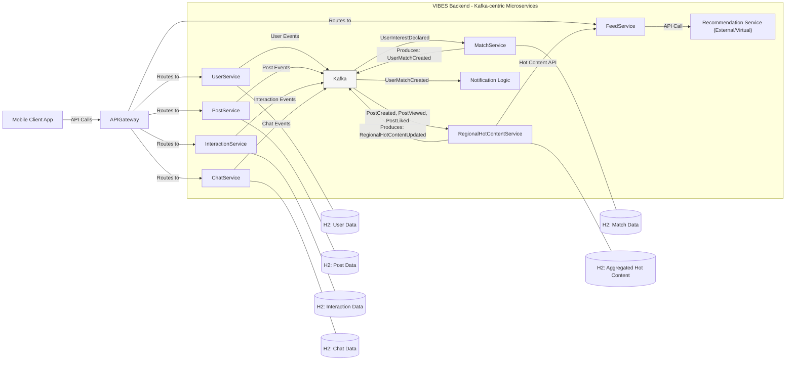

# VIBES 项目 - 工作说明书 (SOW) - MVP阶段

## 1. 项目概览与愿景 (Project Overview & Vision)

VIBES 是一个移动端优先的社交应用，旨在通过聚焦用户的线下约会机会，提供区别于传统社交平台（如 Threads）的核心价值。项目后端将基于 **Apache Kafka 构建的事件驱动架构**，并采用 Spring Boot 框架。VIBES 的成功关键在于通过分析用户在平台上的隐性行为来精准推荐内容与用户，从而提升约会成功率。

**我们的角色:** 作为专注于项目中 Kafka 和 Spring Boot 微服务中间件开发的工程师。

## 2. 目标用户 (Target Audience)

*   希望与他人建立真实线下约会关系的用户。
*   愿意让自己的线上行为（隐性行为）影响平台的内容推荐结果。

## 3. MVP 核心目标 (MVP Core Goals)

1.  **鼓励用户互动:** 通过发帖、浏览、点赞等积极互动，管理自身曝光度。
2.  **隐性用户画像:** 通过用户隐性行为建立个人画像/模型。
3.  **精准推荐:** 基于用户画像，构建推荐引擎，推荐相关内容和用户。
4.  **促成匹配与对话:** 实现行为驱动、画像为中心的匹配和聊天功能。
5.  **Kafka 技术验证:** 以 Kafka 为技术基础，确保系统具备高扩展性和事件驱动能力。

## 4. MVP 范围 (MVP Scope)

### 4.1 我们负责的核心开发内容 (In Scope for Kafka/Spring Boot Engineers)

*   设计和实现基于 Apache Kafka 的事件驱动消息流。
*   开发所有核心业务逻辑的 Spring Boot 微服务。
*   定义和管理事件的 Protobuf Schema，并与 Confluent Schema Registry 集成。
*   实现微服务的数据持久化 (MVP 阶段使用 H2)。
*   搭建 API Gateway (Spring Cloud Gateway)。
*   实现基础的可观测性 (分布式追踪、日志)。
*   编写必要的单元测试和集成测试 (使用 Testcontainers)。

### 4.2 MVP 阶段排除或简化的部分 (Out of Scope / Simplified for MVP)

*   **前端/移动客户端开发:** 不在我们的开发范围内。
*   **完整的推荐引擎算法实现:** `RecommendationService` 将被视为外部或虚拟接口。
*   **复杂的用户授权与安全机制:** MVP 阶段将简化处理，例如不强制严格的 token 校验。
*   **用户隐私问题的深度处理:** 本项目为虚拟学习项目，不深入处理隐私法规遵从。
*   **广告系统、内容审核系统等:** 假定为外部系统。
*   **实际的通知推送服务:** 我们仅负责产生指示通知的 Kafka 事件。
*   **高级搜索、复杂媒体类型（视频）、帖子评论（除点赞外）等高级功能。**

## 5. 系统架构 (System Architecture)

### 5.1 架构模式 (Architectural Pattern)

采用 **服务自治度优先的事件驱动微服务架构 (Service Autonomy focused Event-Driven Microservices Architecture)**。

### 5.2 高层级系统上下文图

### 5.3 核心微服务及其主要职责

*   **API Gateway (`vibes-api-gateway`, Port `8080`):** 统一入口, 路由, SSL (future), 限流 (future), 基础认证 (future).
*   **UserService (`vibes-user-service`, Port `8081`):** 用户注册、登录、资料管理; 发布用户相关事件.
*   **PostService (`vibes-post-service`, Port `8082`):** 帖子创建、查看; 发布帖子相关事件.
*   **InteractionService (`vibes-interaction-service`, Port `8083`):** 处理点赞、表达兴趣; 发布互动相关事件.
*   **MatchService (`vibes-match-service`, Port `8084`):** 消费 `UserInterestDeclaredEvent`, 检测匹配, 发布 `UserMatchCreatedEvent`.
*   **ChatService (`vibes-chat-service`, Port `8085`):** 处理匹配用户间的聊天; 发布聊天消息事件.
*   **RegionalHotContentService (`vibes-regional-hot-content-service`, Port `8086`):** 消费帖子互动事件, 聚合计算区域热门内容, 发布 `RegionalHotContentUpdatedEvent`, 提供 API.
*   **FeedService (`vibes-feed-service`, Port `8087`):** 向客户端提供推荐流, 调用下游服务.

## 6. 技术选型 (Technology Stack)

(详情请参考 `docs/phase3_tech_stack_summary.md`)

*   **Java:** 17 LTS
*   **Build Tool:** Apache Maven
*   **Spring Boot:** `3.2.5`
*   **Spring Cloud:** `2023.0.x` (e.g., `2023.0.1`) (includes Spring Cloud Gateway)
*   **Kafka Clients:** `3.4.1`
*   **Confluent Platform (Schema Registry, Protobuf SerDes):** `7.4.1`
*   **事件序列化:** Protocol Buffers (Protobuf `3.25.3`)
*   **数据持久化 (MVP):** H2 Database Engine (e.g., `2.2.224`)
*   **测试:** JUnit 5 (`5.10.2`), Testcontainers (`1.19.8`)
*   **日志:** SLF4J (`2.0.12`) + Logback
*   **辅助库:** Lombok

## 7. 数据管理 (Data Management)

### 7.1 Kafka 事件 Schema (Protobuf)

所有事件将使用 Protocol Buffers 定义，并通过 Confluent Schema Registry 管理。详细的 `.proto` 文件定义见 `docs/phase5_technical_specification.md` 及项目 `vibes-event-schemas` (或 `vibes-commons`) 模块。

**关键事件列表 (Topic 命名: `vibes.events.<entity>.<action>`):**
*   `UserRegisteredEvent`
*   `UserProfileUpdatedEvent`
*   `UserPhotoUploadedEvent`
*   `PostCreatedEvent`
*   `PostViewedEvent`
*   `PostLikedEvent`
*   `UserInterestDeclaredEvent`
*   `UserMatchCreatedEvent`
*   `ChatMessageSentEvent`
*   `RegionalHotContentUpdatedEvent`

### 7.2 数据持久化 (MVP)

各微服务使用独立的 H2 数据库实例。具体表结构设计参考 `docs/phase4_architecture_design.md` (或 `phase5_technical_specification.md` 中关于数据库 Schema 的讨论)。

### 7.3 API 数据格式

所有 RESTful API 统一使用 JSON (`application/json`)。倾向于为 API 设计专门的 POJO DTOs。

## 8. 跨领域关注点 (Cross-Cutting Concerns - MVP Approach)

*   **API Gateway 路由:** 在 Gateway 配置中直接硬编码下游微服务 URL。
*   **分布式追踪:** 使用 Micrometer Tracing (Spring Boot 3.x 默认) 实现 Correlation ID 跨服务追踪。
*   **错误处理:**
    *   **REST API:** 标准 HTTP 错误码。
    *   **Kafka 消费者:** 使用 Spring Kafka 重试机制；无法处理的消息发送到 Dead Letter Topics (DLTs)。服务实现幂等性。
*   **日志:** SLF4J + Logback，结构化日志，包含 Correlation ID。
*   **安全 (MVP):** 简化处理，不设复杂认证授权。

## 9. 实施计划与任务列表 (Implementation Plan & Task List)

(基于 `docs/phase5_technical_specification.md` 中的实现分解)

### Phase 1: 核心基础设施与基础服务设置
*   [ ] **Task 1.1:** 初始化 Maven 多模块项目结构 (`vibes-parent` 及各子模块: `vibes-api-gateway`, `vibes-user-service`, ..., `vibes-event-schemas`).
*   [ ] **Task 1.2:** 在 `vibes-event-schemas` 模块中定义所有 `.proto` 文件 (common, user, post, interaction, match, chat, regional_content) 并配置 `protobuf-maven-plugin` 和 `build-helper-maven-plugin` 以生成 Java 类。
*   [ ] **Task 1.3:** 编写 Docker Compose 文件 (`docker-compose.yml`) 用于本地启动 Apache Kafka 和 Confluent Schema Registry。
*   [ ] **Task 1.4:** 在 `vibes-api-gateway` 模块中引入 Spring Cloud Gateway 依赖。
*   [ ] **Task 1.5:** 配置 API Gateway 基础路由规则 (可指向临时占位服务或后续开发的服务)。
*   [ ] **Task 1.6:** 配置分布式追踪基础 (e.g., Micrometer Tracing) 在 API Gateway 和一个示例服务中，确保 Correlation ID 生成与传递。
*   [ ] **Task 1.7:** 配置 Testcontainers (`KafkaContainer`, `SchemaRegistryContainer` if available, or mock) 在一个测试模块或父 POM 中，用于后续集成测试。

### Phase 2: 用户模块 (`vibes-user-service`)
*   [ ] **Task 2.1:** 实现用户注册 API (`POST /v1/users/register`):
    *   [ ] 定义注册请求 DTO (含昵称、邮箱/手机、密码、地理位置等)。
    *   [ ] 实现用户数据到 H2 数据库的持久化 (JPA Entity, Repository)。
    *   [ ] 实现密码哈希存储。
    *   [ ] 发布 `UserRegisteredEvent` 到 Kafka (使用 Protobuf, 与 Schema Registry 集成)。
*   [ ] **Task 2.2:** 实现用户登录 API (`POST /v1/users/login`):
    *   [ ] 定义登录请求 DTO。
    *   [ ] 实现密码校验。
    *   [ ] (MVP 简化) 返回成功或失败，不强制实现 JWT/Session。
*   [ ] **Task 2.3:** 实现获取用户资料 API (`GET /v1/users/{userId}`):
    *   [ ] 定义用户资料响应 DTO。
    *   [ ] 从 H2 数据库查询用户数据。
*   [ ] **Task 2.4:** 实现更新用户资料 API (`PUT /v1/users/{userId}`):
    *   [ ] 定义更新请求 DTO。
    *   [ ] 更新 H2 数据库。
    *   [ ] 发布 `UserProfileUpdatedEvent` 到 Kafka。
*   [ ] **Task 2.5:** 实现用户照片上传 API (`POST /v1/users/{userId}/photos` - 简化，只处理元数据):
    *   [ ] 定义照片上传元数据请求 DTO (e.g., photo_url, sequence)。
    *   [ ] 更新 H2 数据库 (关联照片URL到用户)。
    *   [ ] 发布 `UserPhotoUploadedEvent` 到 Kafka。
*   [ ] **Task 2.6:** 为 `vibes-user-service` 编写单元测试和集成测试 (Kafka 生产, H2 交互)。
*   [ ] **Task 2.7:** 在 API Gateway 中配置到 `vibes-user-service` 的路由。

### Phase 3: 帖子模块 (`vibes-post-service`)
*   [ ] **Task 3.1:** 实现创建帖子 API (`POST /v1/posts`):
    *   [ ] 定义创建帖子请求 DTO (含文字内容, 图片URL列表, 地理位置)。
    *   [ ] 实现帖子数据到 H2 数据库的持久化。
    *   [ ] 发布 `PostCreatedEvent` 到 Kafka。
*   [ ] **Task 3.2:** 实现获取帖子详情 API (`GET /v1/posts/{postId}`):
    *   [ ] 定义帖子详情响应 DTO。
    *   [ ] 从 H2 数据库查询帖子数据。
*   [ ] **Task 3.3 (Optional):** 如果决定由 `PostService` 生产 `PostViewedEvent`，需添加相应逻辑。
*   [ ] **Task 3.4:** 为 `vibes-post-service` 编写单元测试和集成测试。
*   [ ] **Task 3.5:** 在 API Gateway 中配置到 `vibes-post-service` 的路由。

### Phase 4: 互动模块 (`vibes-interaction-service`)
*   [ ] **Task 4.1:** 实现点赞帖子 API (`POST /v1/interactions/posts/{postId}/like`):
    *   [ ] 定义点赞请求 DTO (可能只需要 Liker ID 从认证信息获取)。
    *   [ ] 更新 H2 数据库 (记录点赞关系)。
    *   [ ] 发布 `PostLikedEvent` 到 Kafka。
*   [ ] **Task 4.2:** 实现对用户表达兴趣 API (`POST /v1/interactions/users/{targetUserId}/interest`):
    *   [ ] 定义表达兴趣请求 DTO (可能包含来源帖子ID)。
    *   [ ] 更新 H2 数据库 (记录兴趣表达关系)。
    *   [ ] 发布 `UserInterestDeclaredEvent` 到 Kafka。
*   [ ] **Task 4.3 (If needed):** 实现 `PostViewedEvent` 的消费者逻辑，如果浏览行为在此服务处理。
*   [ ] **Task 4.4:** 为 `vibes-interaction-service` 编写单元测试和集成测试。
*   [ ] **Task 4.5:** 在 API Gateway 中配置到 `vibes-interaction-service` 的路由。

### Phase 5: 匹配模块 (`vibes-match-service`)
*   [ ] **Task 5.1:** 实现 `UserInterestDeclaredEvent` Kafka 消费者:
    *   [ ] 配置 Spring Kafka Consumer。
    *   [ ] 从 H2 数据库检查是否存在双向兴趣。
    *   [ ] 如果匹配成功，持久化匹配关系到 H2。
    *   [ ] 发布 `UserMatchCreatedEvent` 到 Kafka。
*   [ ] **Task 5.2 (Optional):** 实现获取用户匹配列表 API (`GET /v1/matches/users/{userId}`):
    *   [ ] 定义匹配列表响应 DTO。
    *   [ ] 从 H2 数据库查询。
*   [ ] **Task 5.3:** 为 `vibes-match-service` 编写单元测试和集成测试 (Kafka 消费和生产)。
*   [ ] **Task 5.4:** 在 API Gateway 中配置到 `vibes-match-service` 的路由 (如果 API存在)。

### Phase 6: 区域热门内容模块 (`vibes-regional-hot-content-service`)
*   [ ] **Task 6.1:** 实现 `PostCreatedEvent`, `PostViewedEvent`, `PostLikedEvent` Kafka 消费者。
*   [ ] **Task 6.2:** 实现基于"每日滚动时间窗口"和"动态半径"（MVP阶段可简化半径逻辑，如固定半径或基于城市）的事件聚合逻辑。
*   [ ] **Task 6.3:** 将聚合结果（热门帖子ID列表、热门用户ID列表、热度分）缓存到 H2 数据库。
*   [ ] **Task 6.4:** 定期（或基于事件量触发）发布 `RegionalHotContentUpdatedEvent` 到 Kafka。
*   [ ] **Task 6.5:** 实现获取区域热门内容 API (`GET /v1/content/regional/hot`):
    *   [ ] 定义请求参数 (如地理位置, 半径, 数量限制)。
    *   [ ] 定义响应 DTO (包含热门帖子和用户列表)。
    *   [ ] 从 H2 缓存查询数据。
*   [ ] **Task 6.6:** 为 `vibes-regional-hot-content-service` 编写单元测试和集成测试。
*   [ ] **Task 6.7:** 在 API Gateway 中配置到 `vibes-regional-hot-content-service` 的路由。

### Phase 7: 推荐流模块 (`vibes-feed-service`)
*   [ ] **Task 7.1:** 实现获取 Feed 流 API (`GET /v1/feed`):
    *   [ ] 定义请求参数 (分页等)。
    *   [ ] 定义 Feed Item DTO 和 Feed 响应 DTO。
    *   [ ] 实现冷启动逻辑: 调用 `RegionalHotContentService` API 获取数据。
    *   [ ] 实现正常运行逻辑: 调用虚拟的 `RecommendationService` API (桩实现或返回固定数据)。
    *   [ ] 聚合和格式化从下游服务获取的数据。
*   [ ] **Task 7.2:** 为 `vibes-feed-service` 编写单元测试 (可 Mock 下游服务调用)。
*   [ ] **Task 7.3:** 在 API Gateway 中配置到 `vibes-feed-service` 的路由。

### Phase 8: 聊天模块 (`vibes-chat-service`)
*   [ ] **Task 8.1:** 实现发送聊天消息 API (`POST /v1/chats/messages`):
    *   [ ] 定义发送消息请求 DTO (含 `chatId/matchId`, `content`)。
    *   [ ] 持久化消息到 H2 数据库。
    *   [ ] 发布 `ChatMessageSentEvent` 到 Kafka。
*   [ ] **Task 8.2:** 实现获取历史消息 API (`GET /v1/chats/{chatId}/messages`):
    *   [ ] 定义消息 DTO 和历史消息响应 DTO (支持分页)。
    *   [ ] 从 H2 数据库查询。
*   [ ] **Task 8.3 (Future or simplified MVP):** 考虑 WebSocket 集成用于实时消息。MVP 阶段可能仅实现 API 轮询。
*   [ ] **Task 8.4:** 为 `vibes-chat-service` 编写单元测试和集成测试。
*   [ ] **Task 8.5:** 在 API Gateway 中配置到 `vibes-chat-service` 的路由。

### Phase 9: 整体集成与测试
*   [ ] **Task 9.1:** 执行端到端手动测试，覆盖核心用户流程 (注册 -> 发帖 -> 点赞/兴趣 -> 匹配 -> 聊天 -> 查看Feed)。
*   [ ] **Task 9.2:** 验证所有 Kafka 事件是否按预期在服务间流动。
*   [ ] **Task 9.3:** 验证分布式追踪和 Correlation ID 是否在所有服务日志中正确记录和传递。
*   [ ] **Task 9.4:** 检查 Actuator 端点 (`/health`, `/metrics`) 是否在各服务可用。
*   [ ] **Task 9.5:** 确保所有服务及其依赖 (Kafka, Schema Registry) 可以通过 Docker Compose 统一启动和运行。
*   [ ] **Task 9.6:** 完善项目 README，包括本地环境搭建、服务启动顺序、API使用示例等。
*   [ ] **Task 9.7:** 代码审查和重构，确保符合之前定义的质量标准。

## 10. 技术成功标准 (MVP Technical Success Criteria)

(同 `docs/phase5_technical_specification.md` 中第4节)

1.  核心事件流程通畅。
2.  核心 API 功能可用。
3.  数据持久化与一致性 (MVP 级别)。
4.  服务可运行与可观测性基础。
5.  代码质量与可维护性基础。
6.  `RegionalHotContentService` 核心逻辑实现。

## 11. 更新本文档 (Updating This Document)

**本文档 (`SOW.md`) 应在项目实施过程中保持更新。当任务完成时，请勾选相应的复选框。如果需求、范围或设计有任何变更，应首先更新本文档及相关的规划文档，并与团队成员同步。** 