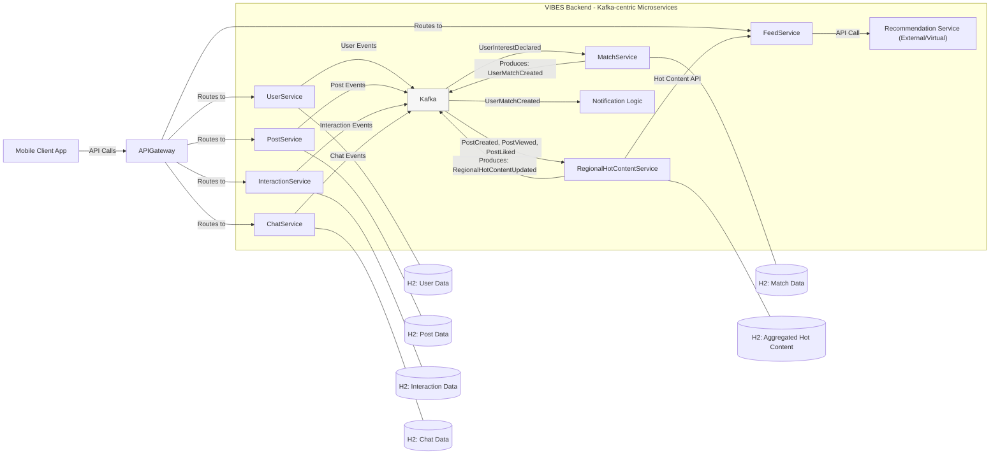

# VIBES 项目初期规划总结 (PHASE 1 & PHASE 2)

## 引言

本文档旨在总结 VIBES 项目在 **PHASE 1: Requirements Analysis (需求分析)** 和 **PHASE 2: System Context Examination (系统上下文审视)** 阶段的讨论成果与关键决策。这些内容将作为后续项目开发和架构设计的基础。

我们的核心角色是**专注于项目中 Kafka 和 Spring Boot 微服务中间件开发的工程师**。本项目是一个以提高 Kafka 开发水平为目的的虚拟项目，因此我们简化或虚拟化了部分模块（如用户授权、隐私处理、完整推荐系统实现、实际通知推送等）。

## PHASE 1: Requirements Analysis Summary (需求分析总结)

此阶段主要基于 `docs/vibes_requirements_phase1.md` 文件进行。

### 1. 核心功能需求概述

VIBES 是一个移动端优先的社交应用，核心是基于 Kafka 的事件驱动架构和 Spring Boot 后端，旨在通过用户行为分析促进线下约会。MVP 阶段的核心功能包括：

*   **用户模块**: 注册、登录、简化版个人资料（昵称、头像、性别、年龄、地区、图片）。
*   **内容模块**: 发布帖子（文字、图片、地理位置）、浏览推荐内容。
*   **互动模块**: 点赞帖子、对其他用户表达兴趣。
*   **匹配模块**: 双方互相表达兴趣后形成匹配。
*   **沟通模块**: 匹配用户间的基础文本聊天。
*   **核心后台模块**:
    *   **推荐流服务 (Feed Service)**: 提供内容给用户，冷启动依赖区域热门，正常运行依赖（虚拟的）推荐引擎。
    *   **区域热门内容服务 (Regional Hot Content Service)**: (我们需要开发) 消费 Kafka 事件 (`PostCreatedEvent`, `PostViewedEvent`, `PostLikedEvent`)，基于**每日滚动的时间窗口**和**动态半径的地理区域**聚合事件，产生 `RegionalHotContentUpdatedEvent`。
    *   **推荐引擎服务 (Recommendation Service)**: (外部或虚拟实现) 提供推荐 API。
    *   **事件流基础设施 (Kafka)**: 所有核心事件通过 Kafka 处理。

### 2. 明确的范围与关注点

*   **关注点**: Kafka Topic 设计、事件结构、Spring Boot 微服务的开发、服务间的事件驱动交互。
*   **简化/虚拟化**:
    *   用户授权、隐私问题：不做深入处理。
    *   推荐引擎：视为外部接口，我们不实现其内部逻辑。
    *   图片处理：仅传递 URL，不处理实际文件存储或复杂元数据。
    *   实际通知推送：我们仅产生指示通知的 Kafka 事件，假定下游系统处理。

### 3. 关键 Kafka 事件 (参考 `vibes_requirements_phase1.md`)

包括 `UserRegisteredEvent`, `PostCreatedEvent`, `PostLikedEvent`, `UserInterestDeclaredEvent`, `UserMatchCreatedEvent`, `ChatMessageSentEvent`, `RegionalHotContentUpdatedEvent` 等。地理位置信息是多数事件的重要组成部分。

### 4. 数据持久化策略

*   **MVP 阶段**: 所有核心微服务（UserService, PostService, InteractionService, MatchService, ChatService, RegionalHotContentService 的缓存）将使用 **H2 嵌入式数据库**。
*   **未来展望 (非 MVP 范围)**: 用户数据考虑 PostgreSQL，帖子数据考虑 MongoDB。

## PHASE 2: System Context Examination Summary (系统上下文审视总结)

### 1. 核心微服务及其主要职责

*   **`UserService`**: 用户注册、登录、资料管理。发布用户相关事件。
*   **`PostService`**: 帖子创建、查看。发布帖子相关事件。
*   **`InteractionService`**: 处理点赞、表达兴趣。发布互动相关事件。
*   **`MatchService`**: 消费 `UserInterestDeclaredEvent`，检测匹配，发布 `UserMatchCreatedEvent`。
*   **`ChatService`**: 处理匹配用户间的聊天。发布聊天消息事件。
*   **`FeedService`**: 向客户端提供推荐流，调用 `RegionalHotContentService` (冷启动) 和虚拟的 `RecommendationService` (正常运行)。
*   **`RegionalHotContentService`**: 消费帖子互动事件，聚合计算区域热门内容，发布 `RegionalHotContentUpdatedEvent`。
*   **`Notification Logic` (概念上/虚拟)**: 消费指示性通知事件 (如 `MatchNotificationEvent`)，实际推送由虚拟下游系统处理。

### 2. API Gateway

*   确定引入 **API Gateway** (如 Spring Cloud Gateway) 来统一客户端请求入口，便于管理和未来扩展。

### 3. 高层级系统上下文图 (Mermaid 描述)

### 4. 关键交互流程示例

*   **用户发帖**: `MobileApp` -> `API Gateway` -> `PostService` -> `Kafka` (`PostCreatedEvent`) -> `RegionalHotContentService` & (virtual) `RecommendationService`.
*   **用户匹配**: `MobileApp` -> `API Gateway` -> `InteractionService` -> `Kafka` (`UserInterestDeclaredEvent`). `MatchService` consumes these, and if mutual, -> `Kafka` (`UserMatchCreatedEvent`) -> `NotificationLogic`.

## 下一步

完成 Phase 1 和 Phase 2 后，下一步将进入 **PHASE 3: Tech Stack (技术选型)**，以确定具体的技术栈版本和其他必要的库。 